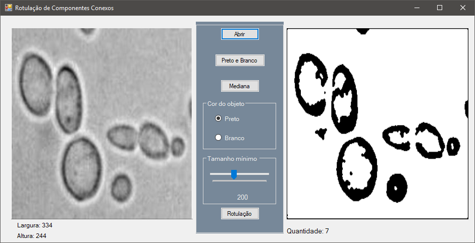
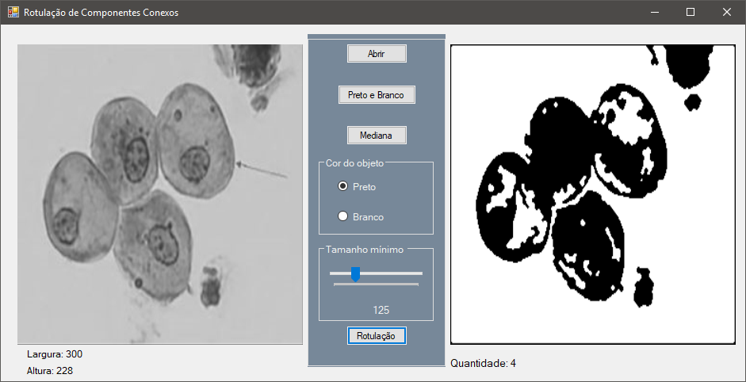
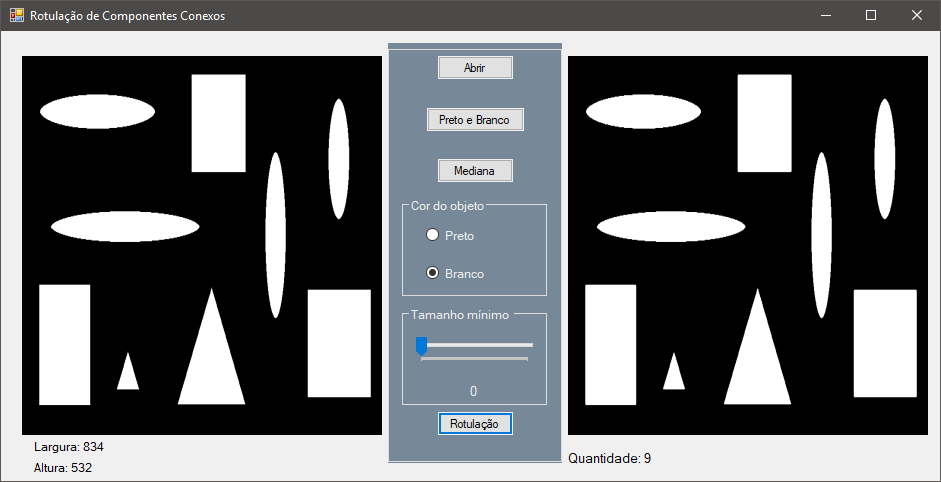

# Rotulação de componentes conexos em C#

  Trabalho proposto pela professora Jaqueline na disciplina de Processamento de Imagens(6º Período) do curso de Ciência da Computação, cujo intuito fora desenvolver um programa capaz de converter uma imagem para binária, aplicar o filtro da mediana, e, por fim, rotular os objetos nela contidos. Para o desenvolvimento de tal trabalho foi utilizada a linguagem C# com o auxílio de Windows Forms para construir a interface gráfica.

  Primeiramente, é preciso carregar uma imagem(esta será convertida para tons de cinza), e, em seguida, convertemos a imagem para uma imagem binária, para que possamos fazer a rotulação dos componentes. Ainda, podemos aplicar várias vezes o filtro da Mediana, se assim o usuário desejar. Este filtro suaviza as bordas da imagem, resultando em uma imagem com menos ruído, ou até mesmo sem qualquer ruído, o que melhorará o processo de rotulação.

  Após a conversão da imagem, podemos escolher em qual cor os objetos se encontram(preto ou branco), pois dependendo da imagem, ao final do processo de conversão para binária, não somos capazes de saber a partir do código fonte qual cor os objetos a serem rotulados obtiveram. Portanto, deve-se marcar a opção referente a cor que os objetos ganharam após a conversão. 

  Feito isso, ainda podemos definir um threshold(limitador), que nos permite ignorar pequenos objetos que, em suma, não deveriam ser contabilizados. Sendo assim, ao definir o threshold, o usuário está especificando um tamanho mínimo para que um objeto possa ser contabilizado. Este tamanho refere-se ao número total de vezes em que um mesmo rótulo foi contabilizado.

  Por fim, é possível realizar então a rotulação dos componentes conexos. O resultado será exibido logo abaixo da imagem convertida, como podem ser visto através das capturas de dela abaixo.

##### Outros desenvolvedores: Willian Perereira Mariano

#### Capturas de tela:

